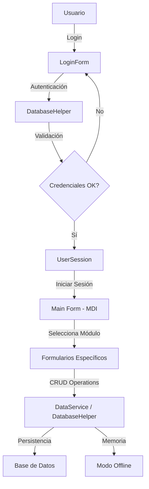

# 🏨 Hotel California - Sistema de Gestión Hotelera

<div align="center">


**Sistema integral de gestión hotelera desarrollado en C# con Windows Forms**

[Características](#-características-principales) • [Instalación](#-instalación) • [Uso](#-guía-de-uso) • [Documentación](#-documentación-técnica) • [Contribuir](#-contribución)

</div>

---

## 📑 Tabla de Contenidos

- [Descripción General](#-descripción-general)
- [Características Principales](#-características-principales)
- [Capturas de Pantalla](#-capturas-de-pantalla)
- [Arquitectura del Sistema](#-arquitectura-del-sistema)
- [Tecnologías y Dependencias](#-tecnologías-y-dependencias)
- [Instalación](#-instalación)
- [Configuración](#-configuración)
- [Guía de Uso](#-guía-de-uso)
- [Documentación Técnica](#-documentación-técnica)
- [Características Avanzadas](#-características-avanzadas)
- [Seguridad](#-seguridad)
- [Testing y Calidad](#-testing-y-calidad)
- [Solución de Problemas](#-solución-de-problemas)
- [FAQ](#-preguntas-frecuentes-faq)
- [Roadmap](#-roadmap)
- [Contribución](#-contribución)
- [Licencia](#-licencia)
- [Contacto y Soporte](#-contacto-y-soporte)

---

## 🎯 Descripción General

**Hotel California** es un sistema completo de gestión hotelera diseñado para hoteles pequeños y medianos. Desarrollado como proyecto académico para Taller de Programación II (2025), combina una interfaz de usuario moderna con funcionalidades robustas para la administración integral de operaciones hoteleras.

### ✨ Ventajas del Sistema

- ✅ **Interfaz Intuitiva**: Diseño moderno y fácil de usar
- ✅ **Sistema de Roles**: Control granular de permisos
- ✅ **Sin Dependencia de Internet**: Funciona completamente offline
- ✅ **Reportes Avanzados**: Generación de informes en PDF y Excel
- ✅ **Backup Automático**: Respaldo programado de datos
- ✅ **Alta Disponibilidad**: Conexiones de respaldo configurables
- ✅ **Extensible**: Arquitectura modular fácil de mantener

---

## 🚀 Características Principales

### 🏨 Módulos del Sistema

<table>
<tr>
<td width="50%">

#### 📊 Dashboard Ejecutivo
- Estadísticas en tiempo real
- Ocupación de habitaciones
- Ingresos del periodo
- Reservas pendientes
- Gráficos y métricas clave

#### 📅 Gestión de Reservas
- Crear y modificar reservas
- Check-in / Check-out
- Estados: Pendiente, Confirmada, Cancelada
- Calendario de disponibilidad
- Búsqueda y filtros avanzados

#### 👥 Administración de Clientes
- Registro completo de huéspedes
- Historial de estancias
- Información de contacto
- Preferencias y notas
- Exportación de datos

</td>
<td width="50%">

#### 🏠 Control de Habitaciones
- Estado: Disponible, Ocupada, Mantenimiento, Limpieza
- Tipos: Individual, Doble, Suite, Deluxe
- Asignación automática
- Gestión de inventario
- Mantenimiento programado

#### 💰 Gestión de Pagos
- Métodos: Efectivo, Tarjeta, Transferencia
- Estados: Pendiente, Parcial, Completado
- Historial de transacciones
- Generación de facturas PDF
- Conciliación bancaria

#### 👨‍💼 Recursos Humanos
- Gestión de empleados
- Control de accesos y roles
- Registro de usuarios del sistema
- Seguimiento de actividades
- Reportes de desempeño

</td>
</tr>
</table>

### 🔐 Sistema de Roles y Permisos

| Rol | Permisos | Acceso |
|-----|----------|--------|
| **🔴 Administrador** | Control total del sistema | Dashboard, Reservas, Clientes, Habitaciones, Pagos, Empleados, Usuarios, Configuración, Backups, Reportes |
| **🟡 Supervisor** | Gestión operativa completa | Dashboard, Reservas, Clientes, Habitaciones, Pagos, Reportes |
| **🟢 Recepcionista** | Operaciones básicas | Reservas (limitado), Clientes (consulta), Habitaciones (consulta) |

### 🎨 Características de Interfaz

- **Diseño Responsivo**: Adaptación a diferentes resoluciones
- **MDI (Multiple Document Interface)**: Múltiples ventanas simultáneas
- **Temas Personalizables**: Esquema de colores consistente
- **Iconografía Clara**: Más de 30 iconos personalizados
- **Validación en Tiempo Real**: Formularios con validación instantánea
- **Mensajes Contextuales**: Feedback claro para el usuario

---

## 📸 Capturas de Pantalla

> **Nota**: Agregue aquí capturas de pantalla de su sistema en funcionamiento

<table>
<tr>
<td width="50%">

### 🔐 Pantalla de Login
```
┌─────────────────────────────────┐
│   HOTEL CALIFORNIA              │
│   Sistema de Gestión            │
│                                 │
│   Usuario: [____________]       │
│   Contraseña: [____________]    │
│                                 │
│   [  INICIAR SESIÓN  ]         │
└─────────────────────────────────┘
```
*Login con validación de credenciales*

</td>
<td width="50%">

### 📊 Dashboard Principal
```
┌─────────────────────────────────┐
│ DASHBOARD | Usuario: admin      │
├─────────────────────────────────┤
│ 📈 Reservas Hoy:     15         │
│ 🏨 Ocupación:        85%        │
│ 💰 Ingresos Mes:  $45,000       │
│ 👥 Clientes Nuevos:  8          │
└─────────────────────────────────┘
```
*Dashboard con métricas en tiempo real*

</td>
</tr>
</table>

---

## 🏗️ Arquitectura del Sistema

### 📂 Estructura de Proyecto

```
Proyecto_Hotel_California/
│
├── 📁 Models/                      # Capa de Modelos
│   ├── Usuario.cs                  # Modelo de usuario con roles
│   ├── Reserva.cs                  # Modelo de reserva
│   ├── Pago.cs                     # Modelo de pagos
│   ├── Cliente.cs                  # Modelo de cliente
│   └── Habitacion.cs               # Modelo de habitación
│
├── 📁 Services/                    # Capa de Servicios
│   ├── DataService.cs              # Servicio de datos en memoria
│   ├── DatabaseHelper.cs           # Helper de base de datos
│   └── ExportacionHelper.cs        # Servicio de exportación
│
├── 📁 Forms/                       # Capa de Presentación
│   ├── LoginForm.cs                # Formulario de autenticación
│   ├── Main.cs                     # Formulario principal (MDI)
│   ├── Home.cs                     # Dashboard/Home
│   ├── Reservas.cs                 # Gestión de reservas
│   ├── CrearReservaForm.cs         # Crear/editar reserva
│   ├── Clientes.cs                 # Gestión de clientes
│   ├── ListaClientes.cs            # Lista de clientes
│   ├── Habitaciones.cs             # Gestión de habitaciones
│   ├── AgregarHab.cs               # Agregar habitación
│   ├── EditarHab.cs                # Editar habitación
│   ├── Pagos.cs                    # Gestión de pagos
│   ├── CrearPagoForm.cs            # Crear pago
│   ├── DetallesPago.cs             # Detalles de pago
│   ├── Empleados.cs                # Gestión de empleados
│   ├── AgregarEmp.cs               # Agregar empleado
│   ├── EditarEmp.cs                # Editar empleado
│   ├── GestionUsuarios.cs          # Gestión de usuarios del sistema
│   ├── FormReportesEstadisticas.cs # Reportes y estadísticas
│   └── Backup.cs                   # Gestión de backups
│
├── 📁 Styles/                      # Estilos y Recursos
│   ├── AppStyles.cs                # Definición de estilos globales
│   └── icons/                      # Iconos del sistema
│       ├── usuario.png
│       ├── reserva.png
│       ├── habitacion.png
│       └── ... (30+ iconos)
│
├── 📁 Utilities/                   # Utilidades
│   ├── UserSession.cs              # Gestión de sesión
│   ├── BaseResponsiveForm.cs       # Formulario base responsivo
│   ├── PasswordHelperBasico.cs     # Helper de contraseñas
│   └── TestConnection.cs           # Test de conexión DB
│
├── 📁 Database/
│   └── Hotel.sql                   # Script de creación de BD
│
├── 📄 App.config                   # Configuración de la aplicación
├── 📄 packages.config              # Dependencias NuGet
├── 📄 HotelCalifornia.csproj       # Archivo de proyecto
└── 📄 README.md                    # Este archivo
```

### 🔄 Arquitectura de Capas

```
┌─────────────────────────────────────────────────────┐
│              CAPA DE PRESENTACIÓN                   │
│   (Windows Forms - Interfaz de Usuario)            │
│   LoginForm │ Main │ Reservas │ Clientes │ ...     │
└────────────────────┬────────────────────────────────┘
                     │
┌────────────────────┴────────────────────────────────┐
│              CAPA DE LÓGICA DE NEGOCIO              │
│   DataService │ DatabaseHelper │ ExportacionHelper  │
└────────────────────┬────────────────────────────────┘
                     │
┌────────────────────┴────────────────────────────────┐
│              CAPA DE DATOS                          │
│   Modelos │ Usuario │ Reserva │ Pago │ Cliente     │
└────────────────────┬────────────────────────────────┘
                     │
┌────────────────────┴────────────────────────────────┐
│              BASE DE DATOS                          │
│   SQL Server Express │ Modo Offline (Memoria)      │
└─────────────────────────────────────────────────────┘
```

### 🔀 Flujo de Datos Principal



---

## 🛠️ Tecnologías y Dependencias

### Plataforma Principal

- **Lenguaje**: C# 7.3
- **Framework**: .NET Framework 4.7.2 / 4.8
- **UI Framework**: Windows Forms
- **Base de Datos**: SQL Server 2016+ / SQL Server Express
- **IDE Recomendado**: Visual Studio 2019 o superior

### 📦 Dependencias NuGet

| Paquete | Versión | Propósito |
|---------|---------|-----------|
| **iTextSharp** | 5.5.13.4 | Generación de documentos PDF (facturas, reportes) |
| **BouncyCastle.Cryptography** | 2.4.0 | Encriptación y seguridad de datos |
| **System.Collections.Immutable** | 9.0.10 | Colecciones inmutables para datos seguros |
| **System.Memory** | 4.5.5 | Optimización de manejo de memoria |
| **System.Buffers** | 4.5.1 | Buffer pooling para mejor rendimiento |
| **System.Numerics.Vectors** | 4.6.1 | Operaciones vectoriales optimizadas |
| **System.Reflection.Metadata** | 9.0.10 | Reflexión y metadatos |
| **System.Resources.Extensions** | 9.0.10 | Manejo extendido de recursos |
| **Microsoft.Bcl.HashCode** | 1.1.1 | Generación de hash codes |
| **System.ValueTuple** | 4.5.0 | Soporte para tuplas de valor |

### 🗄️ Esquema de Base de Datos

El sistema utiliza una base de datos SQL Server con las siguientes tablas principales:

```
Hotel (Database)
│
├── Usuarios              # Usuarios del sistema
│   ├── Id (PK)
│   ├── NombreUsuario
│   ├── PasswordHash
│   ├── Rol
│   ├── EmpleadoId (FK)
│   └── FechaCreacion
│
├── Empleados            # Personal del hotel
│   ├── Id (PK)
│   ├── Nombre
│   ├── Apellido
│   ├── DNI
│   ├── Telefono
│   ├── Email
│   ├── Cargo
│   └── FechaIngreso
│
├── Clientes             # Huéspedes
│   ├── Id (PK)
│   ├── Nombre
│   ├── Apellido
│   ├── DNI
│   ├── Telefono
│   ├── Email
│   └── Direccion
│
├── Habitaciones         # Inventario de habitaciones
│   ├── Id (PK)
│   ├── Numero
│   ├── Tipo
│   ├── PrecioPorNoche
│   ├── Estado
│   ├── Piso
│   └── Capacidad
│
├── Reservas            # Reservaciones
│   ├── Id (PK)
│   ├── ClienteId (FK)
│   ├── HabitacionId (FK)
│   ├── FechaInicio
│   ├── FechaFin
│   ├── Estado
│   ├── MontoTotal
│   ├── NumeroPersonas
│   └── FechaCreacion
│
└── Pagos               # Transacciones
    ├── Id (PK)
    ├── ReservaId (FK)
    ├── Monto
    ├── MetodoPago
    ├── Estado
    ├── FechaPago
    └── Referencia
```

---

## 💿 Instalación

### ⚙️ Requisitos del Sistema

#### Requisitos Mínimos
- **OS**: Windows 10 (64-bit)
- **Procesador**: Intel Core i3 o equivalente
- **RAM**: 4 GB
- **Disco**: 500 MB de espacio libre
- **Resolución**: 1366x768 o superior

#### Requisitos Recomendados
- **OS**: Windows 10/11 (64-bit)
- **Procesador**: Intel Core i5 o superior
- **RAM**: 8 GB o más
- **Disco**: 2 GB de espacio libre (con backups)
- **Resolución**: 1920x1080 o superior

#### Software Necesario
- [.NET Framework 4.7.2+](https://dotnet.microsoft.com/download/dotnet-framework) *(Incluido en Windows 10/11)*
- [SQL Server 2016+](https://www.microsoft.com/sql-server/sql-server-downloads) o **SQL Server Express** *(Gratis)*
- [Visual Studio 2019+](https://visualstudio.microsoft.com/) *(Para desarrollo)*

### 📥 Instalación Paso a Paso

#### Opción 1: Instalación desde Código Fuente

1. **Clonar el Repositorio**
   ```powershell
   git clone https://github.com/gabifirma/proyecto_taller2.git
   cd proyecto_taller2/Proyecto_Hotel_California
   ```

2. **Instalar SQL Server Express** (si no lo tiene)
   ```powershell
   # Descargar SQL Server Express desde:
   # https://www.microsoft.com/sql-server/sql-server-downloads
   
   # O usando Chocolatey:
   choco install sql-server-express
   ```

3. **Crear la Base de Datos**
   ```powershell
   # Opción A: Desde SQL Server Management Studio (SSMS)
   # - Abrir SSMS
   # - Conectarse a (localdb)\MSSQLLocalDB o .\SQLEXPRESS
   # - Abrir el archivo Hotel.sql
   # - Ejecutar el script (F5)
   
   # Opción B: Desde línea de comandos
   sqlcmd -S .\SQLEXPRESS -i Hotel.sql
   ```

4. **Configurar la Cadena de Conexión**
   
   Editar `App.config`:
   ```xml
   <connectionStrings>
     <add name="HotelConnectionString" 
          connectionString="Server=.\SQLEXPRESS;Database=Hotel;Integrated Security=true;TrustServerCertificate=True" 
          providerName="System.Data.SqlClient" />
   </connectionStrings>
   ```
   
   > **Nota**: Ajuste `Server=.\SQLEXPRESS` según su instalación:
   > - `(localdb)\MSSQLLocalDB` para LocalDB
   > - `.\SQLEXPRESS` para SQL Server Express
   > - `localhost` o IP para servidor remoto

5. **Restaurar Paquetes NuGet**
   ```powershell
   # En Visual Studio: Click derecho en Solution > Restore NuGet Packages
   # O desde línea de comandos:
   nuget restore HotelCalifornia.sln
   ```

6. **Compilar el Proyecto**
   
   **Desde Visual Studio:**
   - Abrir `HotelCalifornia.sln`
   - Presionar `Ctrl+Shift+B` o ir a Build > Build Solution
   
   **Desde línea de comandos:**
   ```powershell
   # Usando el script incluido
   .\compilar.bat
   
   # O manualmente con MSBuild
   msbuild HotelCalifornia.sln /p:Configuration=Release
   ```

7. **Ejecutar la Aplicación**
   ```powershell
   # Desde Visual Studio: F5 (con debug) o Ctrl+F5 (sin debug)
   
   # Desde ejecutable:
   cd bin\Release
   .\HotelCalifornia.exe
   ```

#### Opción 2: Instalación desde Release (Ejecutable)

1. **Descargar el Release**
   - Ir a [Releases](https://github.com/gabifirma/proyecto_taller2/releases)
   - Descargar `HotelCalifornia-v1.0.0.zip`

2. **Extraer y Configurar**
   ```powershell
   # Extraer el archivo
   Expand-Archive HotelCalifornia-v1.0.0.zip -DestinationPath C:\HotelCalifornia
   
   # Navegar al directorio
   cd C:\HotelCalifornia
   ```

3. **Ejecutar la Base de Datos**
   - Ejecutar el script `Hotel.sql` en SQL Server

4. **Configurar y Ejecutar**
   - Editar `HotelCalifornia.exe.config` con su cadena de conexión
   - Ejecutar `HotelCalifornia.exe`

---

## ⚙️ Configuración

### 🔧 Archivo App.config

```xml
<?xml version="1.0" encoding="utf-8" ?>
<configuration>
  <startup>
    <supportedRuntime version="v4.0" sku=".NETFramework,Version=v4.7.2" />
  </startup>
  
  <!-- Cadenas de Conexión -->
  <connectionStrings>
    <!-- Conexión Principal -->
    <add name="HotelConnectionString" 
         connectionString="Server=.\SQLEXPRESS;Database=Hotel;Integrated Security=true;TrustServerCertificate=True;Connection Timeout=30" 
         providerName="System.Data.SqlClient" />
    
    <!-- Conexión de Respaldo (Opcional) -->
    <add name="HotelConnectionStringAlt" 
         connectionString="Server=SERVIDOR_BACKUP;Database=Hotel;User Id=usuario;Password=contraseña;TrustServerCertificate=True" 
         providerName="System.Data.SqlClient" />
  </connectionStrings>
  
  <!-- Configuraciones de la Aplicación -->
  <appSettings>
    <!-- Tiempo de sesión en minutos -->
    <add key="SessionTimeout" value="30" />
    
    <!-- Habilitar modo offline -->
    <add key="AllowOfflineMode" value="true" />
    
    <!-- Directorio de backups -->
    <add key="BackupDirectory" value="C:\HotelBackups" />
    
    <!-- Habilitar auto-backup -->
    <add key="AutoBackupEnabled" value="true" />
    
    <!-- Frecuencia de backup (en horas) -->
    <add key="BackupFrequencyHours" value="24" />
    
    <!-- Directorio de reportes -->
    <add key="ReportsDirectory" value="C:\HotelReportes" />
    
    <!-- Formato de fecha predeterminado -->
    <add key="DateFormat" value="dd/MM/yyyy" />
    
    <!-- Moneda predeterminada -->
    <add key="Currency" value="ARS" />
  </appSettings>
</configuration>
```

### 🗄️ Configuraciones de Base de Datos

#### Opción 1: SQL Server Express (Local)
```xml
<add name="HotelConnectionString" 
     connectionString="Server=.\SQLEXPRESS;Database=Hotel;Integrated Security=true;TrustServerCertificate=True" 
     providerName="System.Data.SqlClient" />
```

#### Opción 2: SQL Server LocalDB
```xml
<add name="HotelConnectionString" 
     connectionString="Server=(localdb)\MSSQLLocalDB;Database=Hotel;Integrated Security=true;TrustServerCertificate=True" 
     providerName="System.Data.SqlClient" />
```

#### Opción 3: SQL Server Remoto con Autenticación SQL
```xml
<add name="HotelConnectionString" 
     connectionString="Server=192.168.1.100;Database=Hotel;User Id=hoteluser;Password=SecurePass123;TrustServerCertificate=True" 
     providerName="System.Data.SqlClient" />
```

#### Opción 4: SQL Server con Nombre de Instancia
```xml
<add name="HotelConnectionString" 
     connectionString="Server=SERVIDOR\INSTANCIA;Database=Hotel;Integrated Security=true;TrustServerCertificate=True" 
     providerName="System.Data.SqlClient" />
```

### 📁 Estructura de Directorios

El sistema crea automáticamente los siguientes directorios:

```
C:\
├── HotelBackups\              # Backups de base de datos
│   ├── 2025-01-15_Hotel.bak
│   └── ...
├── HotelReportes\             # Reportes generados
│   ├── Facturas\
│   ├── Estadisticas\
│   └── Exportaciones\
└── HotelLogs\                 # Logs del sistema (opcional)
```

---

## 📖 Guía de Uso

### 🔐 Inicio de Sesión

1. **Ejecutar la Aplicación**
   - Doble click en `HotelCalifornia.exe`
   - Se abrirá la ventana de login

2. **Credenciales Predeterminadas**

   | Usuario | Contraseña | Rol | Descripción |
   |---------|------------|-----|-------------|
   | `admin` | `admin123` | Administrador | Acceso completo al sistema |
   | `supervisor1` | `super123` | Supervisor | Gestión operativa |
   | `recepcion1` | `recepcion123` | Recepcionista | Operaciones básicas |

3. **Primer Inicio de Sesión**
   - Usar credenciales de administrador
   - Se recomienda cambiar las contraseñas inmediatamente
   - El sistema puede pedir crear la base de datos si no existe

### 🏠 Dashboard Principal

El dashboard muestra:

- **📊 Métricas del Día**
  - Reservas activas
  - Check-ins pendientes
  - Check-outs del día
  - Ocupación actual

- **💰 Información Financiera**
  - Ingresos del día
  - Ingresos del mes
  - Pagos pendientes
  - Proyección mensual

- **🔔 Notificaciones**
  - Reservas para hoy
  - Tareas pendientes
  - Alertas del sistema

### 📅 Gestión de Reservas

#### Crear una Nueva Reserva

1. **Ir a Reservas** → Click en "Nueva Reserva"
2. **Seleccionar Cliente**
   - Buscar cliente existente
   - O crear nuevo cliente
3. **Seleccionar Fechas**
   - Fecha de entrada (check-in)
   - Fecha de salida (check-out)
4. **Seleccionar Habitación**
   - El sistema muestra habitaciones disponibles
   - Filtrar por tipo y precio
5. **Confirmar Detalles**
   - Número de personas
   - Observaciones especiales
6. **Guardar Reserva**

#### Estados de Reserva

- **🟡 Pendiente**: Reserva creada, esperando confirmación
- **🟢 Confirmada**: Reserva confirmada, habitación asignada
- **🔵 En Curso**: Cliente ya hizo check-in
- **⚫ Finalizada**: Check-out realizado
- **🔴 Cancelada**: Reserva cancelada

#### Operaciones sobre Reservas

- **✏️ Editar**: Modificar fechas o habitación
- **✅ Check-in**: Marcar llegada del cliente
- **🚪 Check-out**: Finalizar estancia
- **❌ Cancelar**: Cancelar reserva
- **🔍 Ver Detalles**: Ver información completa

### 💰 Gestión de Pagos

#### Registrar un Pago

1. **Seleccionar Reserva** con saldo pendiente
2. **Click en "Nuevo Pago"**
3. **Ingresar Datos**:
   - Monto a pagar
   - Método de pago (Efectivo/Tarjeta/Transferencia)
   - Referencia (opcional)
4. **Confirmar Pago**

#### Generar Factura

1. **Seleccionar Pago** en la lista
2. **Click en "Generar Factura"**
3. **La factura PDF se crea automáticamente**
4. **Se abre para visualización/impresión**

### 👥 Gestión de Clientes

#### Agregar Nuevo Cliente

1. **Ir a Clientes** → "Nuevo Cliente"
2. **Completar Datos**:
   - Nombre y Apellido
   - DNI/Documento
   - Teléfono
   - Email
   - Dirección
3. **Guardar Cliente**

#### Buscar Clientes

- **Búsqueda rápida**: Por nombre, DNI o teléfono
- **Filtros avanzados**: Fecha de registro, estado
- **Ordenamiento**: Por nombre, última visita, etc.

### 🏠 Gestión de Habitaciones

#### Estados de Habitación

- **🟢 Disponible**: Lista para ocupar
- **🔴 Ocupada**: Actualmente en uso
- **🟡 Mantenimiento**: En reparación
- **🔵 Limpieza**: En proceso de limpieza

#### Tipos de Habitación

- **Individual**: 1 persona
- **Doble**: 2 personas
- **Suite**: 3-4 personas con sala
- **Deluxe**: Suite premium con amenities

### 📊 Reportes y Estadísticas

#### Reportes Disponibles

1. **Reporte de Ocupación**
   - Por periodo
   - Por tipo de habitación
   - Tendencias y proyecciones

2. **Reporte de Ingresos**
   - Ingresos totales
   - Desglose por método de pago
   - Comparativas mensuales

3. **Reporte de Clientes**
   - Clientes frecuentes
   - Nuevos clientes
   - Análisis de satisfacción

4. **Reporte de Empleados**
   - Rendimiento
   - Asistencia
   - Evaluaciones

#### Exportar Reportes

- **PDF**: Para impresión y archivo
- **Excel**: Para análisis adicional
- **CSV**: Para importar en otros sistemas

---

## 📚 Documentación Técnica

### 🔌 API Interna - DatabaseHelper

```csharp
// Conexión a la base de datos
public static SqlConnection GetConnection()

// Ejecutar consultas
public static DataTable ExecuteQuery(string query)
public static int ExecuteNonQuery(string query, SqlParameter[] parameters)

// Verificar existencia de tablas
public static bool TablaExiste(string nombreTabla)

// Crear tablas del sistema
public static void CrearTablasDelSistema()
```

### 🎨 Sistema de Estilos - AppStyles

```csharp
// Colores del sistema
public static class Colors
{
    public static Color Primary = Color.FromArgb(41, 128, 185);
    public static Color Secondary = Color.FromArgb(52, 73, 94);
    public static Color Success = Color.FromArgb(46, 204, 113);
    public static Color Danger = Color.FromArgb(231, 76, 60);
    public static Color Warning = Color.FromArgb(241, 196, 15);
    public static Color Info = Color.FromArgb(52, 152, 219);
}

// Fuentes
public static class Fonts
{
    public static Font Title = new Font("Segoe UI", 16F, FontStyle.Bold);
    public static Font Header = new Font("Segoe UI", 12F, FontStyle.Bold);
    public static Font Body = new Font("Segoe UI", 9.75F);
    public static Font Small = new Font("Segoe UI", 8.25F);
}

// Aplicar estilos a controles
public static void ApplyButtonStyle(Button button, ButtonType type)
public static void ApplyTextBoxStyle(TextBox textBox)
public static void ApplyDataGridStyle(DataGridView dgv)
```

### 🔐 Gestión de Sesión - UserSession

```csharp
// Propiedades de sesión
public static int UserId { get; set; }
public static string Username { get; set; }
public static string Rol { get; set; }
public static DateTime LoginTime { get; set; }

// Métodos
public static void IniciarSesion(int userId, string username, string rol)
public static void CerrarSesion()
public static bool EsAdministrador()
public static bool EsSupervisor()
public static bool EsRecepcionista()
public static bool TienePermiso(string permiso)
```

### 📄 Generación de PDFs - Uso de iTextSharp

```csharp
using iTextSharp.text;
using iTextSharp.text.pdf;

// Ejemplo: Generar factura
public void GenerarFacturaPDF(Pago pago, Reserva reserva)
{
    Document document = new Document(PageSize.A4);
    PdfWriter.GetInstance(document, new FileStream(path, FileMode.Create));
    
    document.Open();
    
    // Agregar contenido
    document.Add(new Paragraph($"Factura N° {pago.Id}"));
    document.Add(new Paragraph($"Fecha: {pago.FechaPago:dd/MM/yyyy}"));
    // ... más contenido
    
    document.Close();
}
```

### 🗄️ Modelos de Datos

#### Modelo Usuario
```csharp
public class Usuario
{
    public int Id { get; set; }
    public string NombreUsuario { get; set; }
    public string PasswordHash { get; set; }
    public string Rol { get; set; } // "Administrador", "Supervisor", "Recepcionista"
    public int? EmpleadoId { get; set; }
    public DateTime FechaCreacion { get; set; }
    public bool Activo { get; set; }
}
```

#### Modelo Reserva
```csharp
public class Reserva
{
    public int Id { get; set; }
    public int ClienteId { get; set; }
    public int HabitacionId { get; set; }
    public DateTime FechaInicio { get; set; }
    public DateTime FechaFin { get; set; }
    public string Estado { get; set; } // "Pendiente", "Confirmada", "Cancelada", "Finalizada"
    public decimal MontoTotal { get; set; }
    public int NumeroPersonas { get; set; }
    public string Observaciones { get; set; }
    public DateTime FechaCreacion { get; set; }
}
```

#### Modelo Pago
```csharp
public class Pago
{
    public int Id { get; set; }
    public int ReservaId { get; set; }
    public decimal Monto { get; set; }
    public string MetodoPago { get; set; } // "Efectivo", "Tarjeta", "Transferencia"
    public string Estado { get; set; } // "Pendiente", "Completado", "Parcial"
    public DateTime FechaPago { get; set; }
    public string Referencia { get; set; }
}
```

---

## 🚀 Características Avanzadas

### 💾 Sistema de Backup

El sistema incluye funcionalidad completa de backup:

- **Backup Manual**: Desde el menú Administración
- **Backup Automático**: Programado cada 24 horas
- **Backup Incremental**: Solo cambios desde último backup
- **Restauración**: Desde archivo .bak

#### Realizar Backup Manual

1. **Ir a Administración** → "Backup de Base de Datos"
2. **Seleccionar Ubicación** (por defecto: `C:\HotelBackups`)
3. **Click en "Crear Backup"**
4. **El sistema genera**: `YYYY-MM-DD_Hotel.bak`

#### Restaurar desde Backup

```sql
-- En SQL Server Management Studio
USE master
GO
RESTORE DATABASE Hotel
FROM DISK = 'C:\HotelBackups\2025-01-15_Hotel.bak'
WITH REPLACE
GO
```

### 📊 Exportación de Datos

#### Exportar a Excel

```csharp
// Usar ExportacionHelper
ExportacionHelper.ExportarAExcel(dataGridView, "Reservas_2025.xlsx");
```

Formatos soportados:
- ✅ Excel (.xlsx)
- ✅ CSV (.csv)
- ✅ PDF (.pdf)
- ✅ JSON (.json)

### 📧 Generación de Facturas

Las facturas se generan automáticamente en formato PDF con:

- Logo del hotel (configurable)
- Datos del cliente
- Detalles de la reserva
- Desglose de pagos
- Código QR para validación
- Firma digital

### 📈 Análisis y Estadísticas

El módulo de reportes incluye:

- **Gráficos de Tendencias**: Ocupación en el tiempo
- **Análisis Predictivo**: Proyecciones de ingresos
- **Comparativas**: Año a año, mes a mes
- **KPIs**: Indicadores clave de rendimiento

---

## 🔒 Seguridad

### 🛡️ Medidas de Seguridad Implementadas

1. **Autenticación**
   - Contraseñas hasheadas (no se almacenan en texto plano)
   - Sistema de sesiones con timeout
   - Cierre automático tras inactividad

2. **Autorización**
   - Control de acceso basado en roles (RBAC)
   - Permisos granulares por módulo
   - Validación de permisos en cada operación

3. **Protección de Datos**
   - Encriptación de datos sensibles
   - Uso de BouncyCastle para criptografía
   - Conexiones seguras a base de datos

4. **Auditoría**
   - Registro de acciones críticas
   - Logs de inicio/cierre de sesión
   - Trazabilidad de cambios

5. **SQL Injection Prevention**
   - Uso de parámetros en todas las consultas
   - Validación de entrada de usuario
   - Sanitización de datos

### 🔑 Gestión de Contraseñas

```csharp
// Las contraseñas se hashean antes de almacenar
string hashedPassword = PasswordHelperBasico.HashPassword(password);

// Verificación segura
bool isValid = PasswordHelperBasico.VerifyPassword(password, hashedPassword);
```

### 🚨 Recomendaciones de Seguridad

- ✅ Cambiar contraseñas predeterminadas
- ✅ Usar contraseñas fuertes (8+ caracteres, mayúsculas, números, símbolos)
- ✅ No compartir credenciales entre usuarios
- ✅ Revisar logs de acceso regularmente
- ✅ Mantener backups en ubicación segura
- ✅ Actualizar el sistema regularmente

---

## 🧪 Testing y Calidad

### ✅ Pruebas Implementadas

- **Pruebas de Conexión**: `TestConnection.cs` verifica conectividad
- **Validación de Datos**: Cada formulario valida entrada de usuario
- **Manejo de Errores**: Try-catch en operaciones críticas
- **Logging**: Registro de excepciones y errores

### 🐛 Debugging

Para habilitar modo debug:

```xml
<!-- En App.config -->
<appSettings>
  <add key="DebugMode" value="true" />
  <add key="LogLevel" value="Verbose" />
</appSettings>
```

---

## 🔧 Solución de Problemas

### ❌ Error: "No se puede conectar a la base de datos"

**Causas posibles**:
- SQL Server no está ejecutándose
- Cadena de conexión incorrecta
- Firewall bloqueando conexión

**Soluciones**:
```powershell
# Verificar que SQL Server esté corriendo
Get-Service | Where-Object {$_.Name -like "*SQL*"}

# Iniciar SQL Server si está detenido
Start-Service MSSQL$SQLEXPRESS

# Verificar conectividad
sqlcmd -S .\SQLEXPRESS -Q "SELECT @@VERSION"
```

### ❌ Error: "Base de datos 'Hotel' no existe"

**Solución**:
```powershell
# Ejecutar el script de creación
sqlcmd -S .\SQLEXPRESS -i Hotel.sql
```

### ❌ Error: "Acceso denegado" o permisos insuficientes

**Solución**:
1. Ejecutar Visual Studio/aplicación como Administrador
2. Verificar permisos en SQL Server:
```sql
-- Dar permisos al usuario
USE Hotel;
GO
GRANT ALL TO [USUARIO];
GO
```

### ❌ Error: "No se puede cargar el assembly iTextSharp"

**Solución**:
```powershell
# Restaurar paquetes NuGet
nuget restore HotelCalifornia.sln

# O en Visual Studio
# Tools > NuGet Package Manager > Package Manager Console
Update-Package -reinstall
```

### ❌ Aplicación lenta o no responde

**Causas y Soluciones**:
- **Base de datos grande**: Realizar mantenimiento (DBCC, reindex)
- **Muchos registros**: Implementar paginación
- **Conexión lenta**: Verificar red y cadena de conexión
- **Memoria insuficiente**: Cerrar aplicaciones innecesarias

### 🆘 Modo de Recuperación

Si el sistema no inicia:

1. **Verificar logs** en `C:\HotelLogs`
2. **Modo sin BD**: El sistema puede funcionar offline
3. **Reinstalar**: Restaurar desde backup

---

## ❓ Preguntas Frecuentes (FAQ)

<details>
<summary><b>¿Puedo usar el sistema sin SQL Server?</b></summary>

Sí, el sistema tiene un **modo offline** que almacena datos en memoria. Sin embargo, los datos no persisten al cerrar la aplicación. Para uso productivo, se recomienda SQL Server.
</details>

<details>
<summary><b>¿Cómo agregar un nuevo usuario administrador?</b></summary>

1. Iniciar sesión como administrador
2. Ir a **Gestión de Usuarios**
3. Click en **"Nuevo Usuario"**
4. Completar datos y seleccionar rol **"Administrador"**
5. Guardar
</details>

<details>
<summary><b>¿Puedo cambiar los colores de la interfaz?</b></summary>

Sí, editando la clase `AppStyles.cs`:
```csharp
public static Color Primary = Color.FromArgb(41, 128, 185); // Cambiar aquí
```
</details>

<details>
<summary><b>¿El sistema soporta múltiples hoteles?</b></summary>

No en la versión actual (v1.0.0). Está planeado para v2.0 (ver [Roadmap](#-roadmap)).
</details>

<details>
<summary><b>¿Cómo exporto todos mis datos?</b></summary>

Desde **Reportes y Estadísticas** → **Exportación Completa** → Seleccionar formato (Excel/CSV).
</details>

<details>
<summary><b>¿Puedo acceder desde múltiples computadoras?</b></summary>

Sí, si configuran la misma base de datos SQL Server en red. Cada PC necesita tener instalada la aplicación.
</details>

<details>
<summary><b>¿Qué hago si olvidé la contraseña del administrador?</b></summary>

Ejecutar este SQL en la base de datos:
```sql
UPDATE Usuarios 
SET PasswordHash = [HASH_DE_NUEVA_CONTRASEÑA]
WHERE NombreUsuario = 'admin';
```
O recrear el usuario desde el script de inicialización.
</details>

---

## 🗺️ Roadmap

### 📅 Versión 1.1 (Q1 2025)

- [ ] Sistema de notificaciones por email
- [ ] Integración con pasarelas de pago
- [ ] App móvil para recepción
- [ ] Mejoras en reportes (más gráficos)
- [ ] Soporte para múltiples idiomas

### 📅 Versión 2.0 (Q2 2025)

- [ ] Soporte para múltiples hoteles/sucursales
- [ ] Portal web para clientes (auto check-in)
- [ ] Integración con OTAs (Booking, Airbnb)
- [ ] Sistema de fidelización de clientes
- [ ] API REST para integraciones

### 📅 Versión 3.0 (Q4 2025)

- [ ] Inteligencia Artificial para predicciones
- [ ] Sistema de revenue management
- [ ] Automatización completa de check-in/out
- [ ] Integración con cerraduras inteligentes
- [ ] Dashboard en tiempo real con WebSockets

---

## 🤝 Contribución

¡Las contribuciones son bienvenidas! Este es un proyecto académico pero abierto a mejoras.

### 📋 Cómo Contribuir

1. **Fork** el repositorio
2. **Crear una rama** para tu feature
   ```powershell
   git checkout -b feature/nueva-caracteristica
   ```
3. **Hacer commit** de tus cambios
   ```powershell
   git commit -m "Agregar: nueva característica increíble"
   ```
4. **Push** a tu fork
   ```powershell
   git push origin feature/nueva-caracteristica
   ```
5. **Abrir un Pull Request** en GitHub

### 📝 Guía de Estilo

#### Convenciones de Código C#

```csharp
// ✅ BIEN: PascalCase para clases y métodos
public class GestorReservas
{
    public void CrearReserva() { }
}

// ✅ BIEN: camelCase para variables locales
int numeroHabitacion = 101;

// ✅ BIEN: _ prefix para campos privados
private int _contadorReservas;

// ✅ BIEN: Comentarios XML para documentación
/// <summary>
/// Crea una nueva reserva en el sistema
/// </summary>
/// <param name="clienteId">ID del cliente</param>
/// <returns>ID de la reserva creada</returns>
public int CrearReserva(int clienteId) { }
```

#### Estructura de Commits

```
tipo(ámbito): descripción corta

Descripción más detallada si es necesario.

Fixes #123
```

**Tipos de commit**:
- `feat`: Nueva característica
- `fix`: Corrección de bug
- `docs`: Cambios en documentación
- `style`: Cambios de formato (no afectan funcionalidad)
- `refactor`: Refactorización de código
- `test`: Agregar o modificar tests
- `chore`: Mantenimiento (dependencias, etc.)

**Ejemplo**:
```
feat(reservas): agregar validación de fechas solapadas

Se implementa validación para evitar reservas con fechas
que se solapan con reservas existentes de la misma habitación.

Fixes #45
```

### 🐛 Reportar Bugs

Usar el [Issue Tracker](https://github.com/gabifirma/proyecto_taller2/issues) con:

- **Título claro** describiendo el problema
- **Pasos para reproducir** el error
- **Comportamiento esperado** vs. obtenido
- **Screenshots** si es posible
- **Ambiente**: OS, versión de .NET, SQL Server, etc.

### 💡 Sugerir Mejoras

Abrir un Issue con la etiqueta `enhancement`:

- Descripción clara de la funcionalidad
- Casos de uso
- Mockups o diagramas (opcional)
- Impacto estimado

---

## 📄 Licencia

Este proyecto está licenciado bajo la **Licencia MIT**.

```
MIT License

Copyright (c) 2025 Hotel California - Taller de Programación II

Permission is hereby granted, free of charge, to any person obtaining a copy
of this software and associated documentation files (the "Software"), to deal
in the Software without restriction, including without limitation the rights
to use, copy, modify, merge, publish, distribute, sublicense, and/or sell
copies of the Software, and to permit persons to whom the Software is
furnished to do so, subject to the following conditions:

The above copyright notice and this permission notice shall be included in all
copies or substantial portions of the Software.

THE SOFTWARE IS PROVIDED "AS IS", WITHOUT WARRANTY OF ANY KIND, EXPRESS OR
IMPLIED, INCLUDING BUT NOT LIMITED TO THE WARRANTIES OF MERCHANTABILITY,
FITNESS FOR A PARTICULAR PURPOSE AND NONINFRINGEMENT. IN NO EVENT SHALL THE
AUTHORS OR COPYRIGHT HOLDERS BE LIABLE FOR ANY CLAIM, DAMAGES OR OTHER
LIABILITY, WHETHER IN AN ACTION OF CONTRACT, TORT OR OTHERWISE, ARISING FROM,
OUT OF OR IN CONNECTION WITH THE SOFTWARE OR THE USE OR OTHER DEALINGS IN THE
SOFTWARE.
```

---

## 📞 Contacto y Soporte

### 👥 Equipo de Desarrollo

**Proyecto Académico**  
Taller de Programación II - 2025

### 🐛 Reportar Problemas

- **GitHub Issues**: [Crear Issue](https://github.com/gabifirma/proyecto_taller2/issues)
- **Documentación**: [Wiki del Proyecto](https://github.com/gabifirma/proyecto_taller2/wiki)

### 📧 Contacto

- **Email**: [Agregar email de contacto]
- **Repositorio**: [github.com/gabifirma/proyecto_taller2](https://github.com/gabifirma/proyecto_taller2)

### 🌟 Agradecimientos

- Microsoft por .NET Framework y Visual Studio
- Comunidad de iTextSharp
- Stack Overflow y comunidad de desarrolladores
- Profesores y compañeros del Taller de Programación II

---

<div align="center">

### ⭐ Si este proyecto te fue útil, considera darle una estrella en GitHub

**Hotel California** © 2025

*"You can check out any time you like, but you can never leave!"* 🎸

[⬆ Volver arriba](#-hotel-california---sistema-de-gestión-hotelera)

</div>
